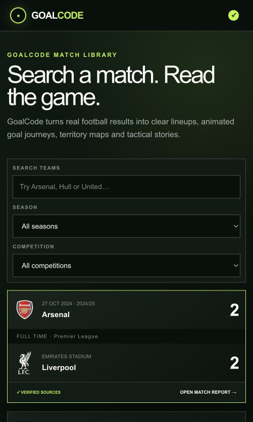
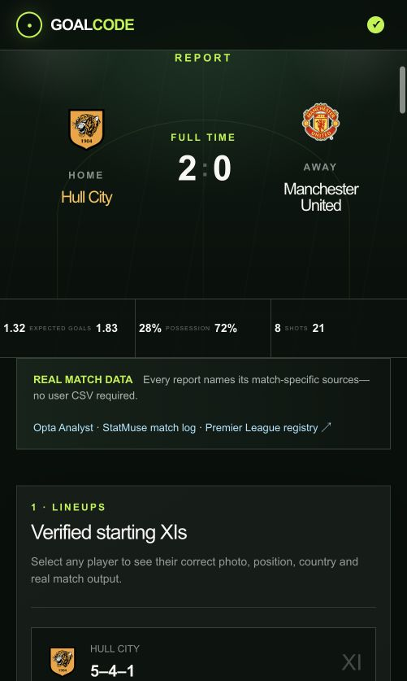

# GoalCode

GoalCode is an interactive football match-intelligence platform that turns real match data into clear visual stories. Search a match, inspect the verified starting XIs, replay every goal step by step, compare territory and pressing, and explore how each team changed shape.

**Deployment:** The repository is ready for a future Render deployment.



## What you can explore

- Searchable match library with season and competition filters
- StatsBomb Premier League archive with 418 real matches
- Event-derived xG, shot locations, passing and starting lineups loaded on demand
- Real scorelines, lineups, scorers and team statistics
- Five-step animated goal journeys with a visible ball path and goal celebration
- Separate team territory maps for possession, touches, xT, progression and pressing
- First-half and second-half attacking directions
- Interactive formation evolution
- Clickable player profiles and collectible performance cards
- Responsive mobile layout
- Match-specific source attribution

## Included matches

### StatsBomb Premier League archive

- Complete 2015/16 season: 380 matches
- Arsenal's 2003/04 Invincibles season: 38 matches
- Real event files and starting lineups load when an archive match is opened

### Arsenal 2–2 Liverpool — 27 October 2024

A four-goal Premier League report featuring Saka, Van Dijk, Merino and Salah.

### Hull City 2–0 Manchester United — 22 August 2026

Hull City's opening-day Premier League win, featuring goals from Semi Ajayi and Nobel Mendy.



## Data sources

GoalCode combines public match records from:

- [StatsBomb Open Data](https://github.com/hudl/open-data) for the historical Premier League match index, event coordinates, xG and lineups
- [Opta Analyst](https://theanalyst.com/articles/hull-city-vs-manchester-united-stats-premier-league-08-2026)
- [StatMuse Football](https://www.statmuse.com/fc/match/8-22-2026-hul-vs-mun-112764)
- [Premier League player registry and assets](https://www.premierleague.com/)
- Public match reports used to verify goal sequences

Exact match facts are treated as verified data. StatsBomb-derived figures are calculated directly from its public event files and attributed in the interface. Tactical shapes, territory intensity and drawn goal paths are clearly presented as event-based visual reconstructions when full tracking coordinates are not publicly available.

## Technology

- React
- TypeScript
- Vinext / Vite
- CSS animations and responsive layouts
- Render-ready production build

## Run locally

```bash
npm install
npm run dev
```

Open the local URL printed by the development server.

## Production build

```bash
npm run build
```

## Project direction

The next stage is to connect a current-season fixtures API alongside the historical StatsBomb archive. Current-season player-total datasets can enrich player profiles, but event-level data is still required for shot maps, xG and replay features.

---

Built as a football analytics and product-design portfolio project.
